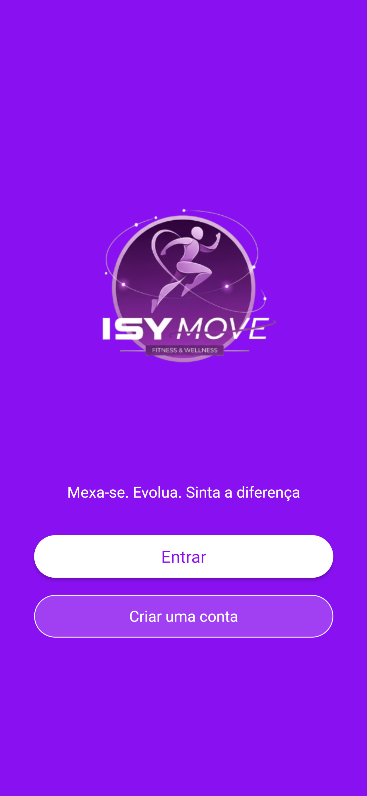
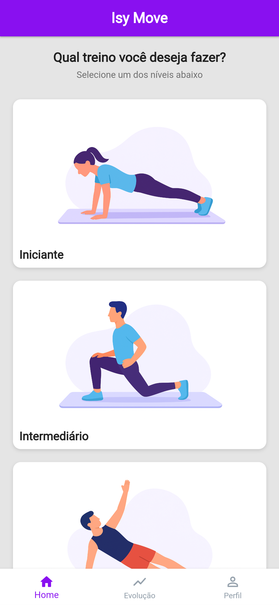
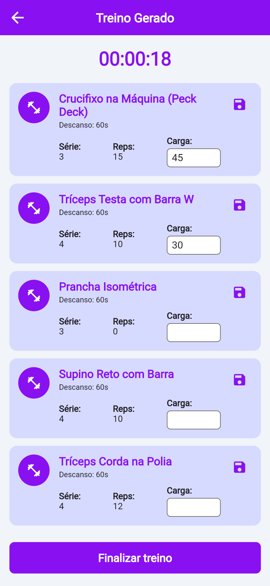
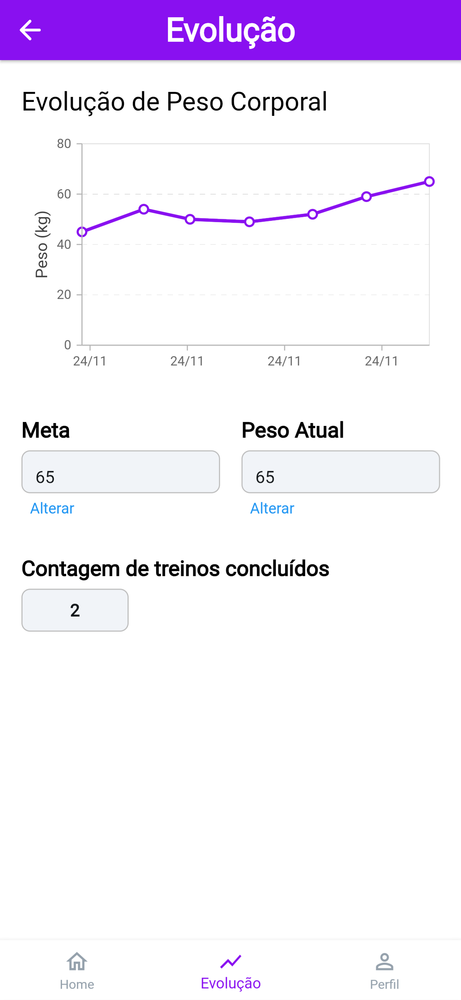

# Isy Move 🏋️‍♂️

> **Mexa-se. Evolua. Sinta a diferença.**


## 📄 Sobre o Projeto

O **Isy Move** é um aplicativo móvel de fitness desenvolvido como Trabalho de Conclusão de Curso (TCC) no curso de Bacharelado em Sistemas de Informação. 

O objetivo do app é auxiliar usuários em sua jornada de evolução física, oferecendo um sistema de progressão onde o usuário desbloqueia níveis (**Iniciante, Intermediário e Avançado**) conforme completa seus treinos. O sistema conta com geração de treinos, histórico de cargas e acompanhamento gráfico de peso corporal.

---

## 📱 Funcionalidades Principais

* **🔐 Autenticação Segura:** Login, Cadastro e Recuperação de Senha integrados ao Supabase Auth.
* **🏆 Sistema de Níveis:**
    * **Iniciante:** Treinos de adaptação.
    * **Intermediário:** Desbloqueado após 15 treinos iniciantes.
    * **Avançado:** Desbloqueado após 40 treinos intermediários (Geração de treinos dinâmicos baseados em grupos musculares).
* **📊 Monitoramento de Evolução:**
    * Gráficos de evolução de peso corporal (integração com `syncfusion_flutter_charts`).
    * Contador de treinos cumulativo (lógica de saldo inicial para novos usuários).
    * Armazenamento de cargas utilizadas durante o treino.
* **⚙️ Gestão de Perfil:** Alteração de senha e exclusão de conta.

---

## 🎨 Screenshots

| Login & Cadastro | Home & Níveis | Execução de Treino | Gráfico de Evolução |
|:---:|:---:|:---:|:---:|
|  |  |  |  |

---

## 🛠️ Tecnologias Utilizadas

O projeto foi desenvolvido utilizando as seguintes tecnologias:

* **Frontend:** [Flutter](https://flutter.dev/) (Dart) 
* **Prototipagem/Base:** FlutterFlow (Exportado)
* **Backend & Database:** [Supabase](https://supabase.com/) (PostgreSQL)
* **Gerenciamento de Estado:** Provider & ChangeNotifiers
* **Navegação:** GoRouter
* **Gráfico de evolução:** Syncfusion Flutter Charts

---

## 🗄️ Estrutura do Banco de Dados (Supabase)

O sistema utiliza um banco relacional PostgreSQL hospedado no Supabase. Suas tabelas são:

* `usuario`: Dados cadastrais, nível atual e meta de peso.
* `progresso`: Contador de treinos concluídos e lógica de desconto inicial.
* `historico_peso`: Registro de pesos para geração do gráfico de evolução.
* `treinos_fixos`: Base de dados dos exercícios e treinos pré-definidos (iniciante e intermediário).
* `historico_cargas`: Últimas cargas salvas pelo usuário.
* `exercicio`: Tabela para guardar exercícios para geração de treinos avançados. 

---

## 🚀 Como rodar o projeto

### Pré-requisitos

* **Flutter SDK:** Versão estável recente (3.19.x ou superior).
* **Git:** Para clonar o repositório.
* **Editor:** VS Code ou Android Studio.
* **Dispositivo:** Celular Android ou Emulador.

### Passo a passo

1.  **Clone o repositório**
    https://github.com/IsabelaNunes0602/Isy-Move.git <br/>
    Abra o terminal e digite:
    ```bash
    git clone 
    ```

2.  **Entre na pasta do projeto**
    ```bash
    cd Isy-Move
    ```

3.  **Instale as dependências**
    ```bash
    flutter pub get
    ```

4.  **Execute o projeto**
    Com o dispositivo conectado, rode:
    ```bash
    flutter run
    ```

---


## 👨‍💻 Autoras

**Isabela Batista Ferreira Nunes**<br/>
**Sylvana Alves Bezerra**

Formandas de Bacharelado em Sistemas de Informação

<br/>

---
<p align="center">
  Desenvolvido para o Trabalho de Conclusão de Curso - 2025
</p>
